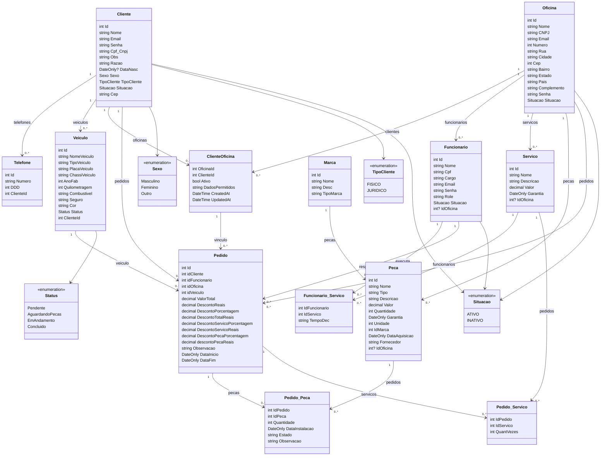

# SIGO Backend Class Diagram

Generated from the current ASP.NET Core project structure:

- Domain entities: `SIGO/Objects/Models`
- EF Core mappings: `SIGO/Data/Builders` and `SIGO/Data/AppDbContext.cs`

Notes:

- `ClienteOficina`, `Pedido_Peca`, `Pedido_Servico`, and `Funcionario_Servico` are explicit join entities.
- `Pedido` connects the customer, workshop, employee, vehicle, parts, and services involved in the work order.
