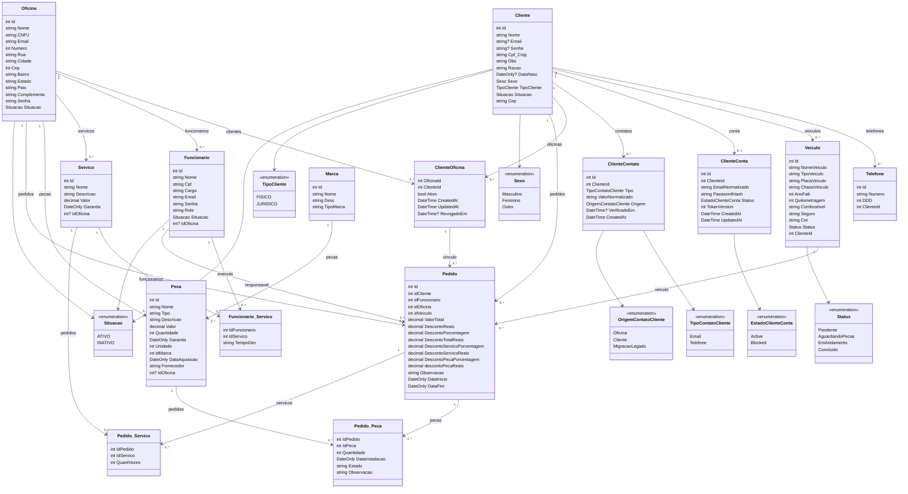

# SIGO Backend Class Diagram

Generated from the current ASP.NET Core project structure:

- Domain entities: `SIGO/Objects/Models`
- EF Core mappings: `SIGO/Data/Builders` and `SIGO/Data/AppDbContext.cs`

```mermaid
classDiagram
direction TB

%% Core actors
class Cliente {
  int Id
  string Nome
  string? Email
  string? Senha
  string Cpf_Cnpj
  string Obs
  string Razao
  DateOnly? DataNasc
  Sexo Sexo
  TipoCliente TipoCliente
  Situacao Situacao
  string Cep
}

class ClienteConta {
  int Id
  int ClienteId
  string EmailNormalizado
  string PasswordHash
  EstadoClienteConta Status
  int TokenVersion
  DateTime CreatedAt
  DateTime UpdatedAt
}

class ClienteContato {
  int Id
  int ClienteId
  TipoContatoCliente Tipo
  string ValorNormalizado
  OrigemContatoCliente Origem
  DateTime? VerificadoEm
  DateTime CreatedAt
}

class Oficina {
  int Id
  string Nome
  string CNPJ
  string Email
  int Numero
  string Rua
  string Cidade
  int Cep
  string Bairro
  string Estado
  string Pais
  string Complemento
  string Senha
  Situacao Situacao
}

class Funcionario {
  int Id
  string Nome
  string Cpf
  string Cargo
  string Email
  string Senha
  string Role
  Situacao Situacao
  int? IdOficina
}

class ClienteOficina {
  int OficinaId
  int ClienteId
  bool Ativo
  DateTime CreatedAt
  DateTime UpdatedAt
  DateTime? RevogadoEm
}

class Telefone {
  int Id
  string Numero
  int DDD
  int ClienteId
}

class Veiculo {
  int Id
  string NomeVeiculo
  string TipoVeiculo
  string PlacaVeiculo
  string ChassiVeiculo
  int AnoFab
  int Quilometragem
  string Combustivel
  string Seguro
  string Cor
  Status Status
  int ClienteId
}

%% Catalog
class Servico {
  int Id
  string Nome
  string Descricao
  decimal Valor
  DateOnly Garantia
  int? IdOficina
}

class Funcionario_Servico {
  int IdFuncionario
  int IdServico
  string TempoDec
}

class Marca {
  int Id
  string Nome
  string Desc
  string TipoMarca
}

class Peca {
  int Id
  string Nome
  string Tipo
  string Descricao
  decimal Valor
  int Quantidade
  DateOnly Garantia
  int Unidade
  int IdMarca
  DateOnly DataAquisicao
  string Fornecedor
  int? IdOficina
}

%% Order aggregate
class Pedido {
  int Id
  int idCliente
  int idFuncionario
  int idOficina
  int idVeiculo
  decimal ValorTotal
  decimal DescontoReais
  decimal DescontoPorcentagem
  decimal DescontoTotalReais
  decimal DescontoServicoPorcentagem
  decimal DescontoServicoReais
  decimal DescontoPecaPorcentagem
  decimal descontoPecaReais
  string Observacao
  DateOnly DataInicio
  DateOnly DataFim
}

class Pedido_Peca {
  int IdPedido
  int IdPeca
  int Quantidade
  DateOnly DataInstalacao
  string Estado
  string Observacao
}

class Pedido_Servico {
  int IdPedido
  int IdServico
  int QuantVezes
}

%% Enums
class Situacao {
  <<enumeration>>
  ATIVO
  INATIVO
}

class Sexo {
  <<enumeration>>
  Masculino
  Feminino
  Outro
}

class TipoCliente {
  <<enumeration>>
  FISICO
  JURIDICO
}

class Status {
  <<enumeration>>
  Pendente
  AguardandoPecas
  EmAndamento
  Concluido
}

class EstadoClienteConta {
  <<enumeration>>
  Active
  Blocked
}

class TipoContatoCliente {
  <<enumeration>>
  Email
  Telefone
}

class OrigemContatoCliente {
  <<enumeration>>
  Oficina
  Cliente
  MigracaoLegado
}

%% Customer and workshop ownership
Cliente "1" --> "0..*" Telefone : telefones
Cliente "1" --> "0..*" Veiculo : veiculos
Cliente "1" --> "0..1" ClienteConta : conta
Cliente "1" --> "0..*" ClienteContato : contatos
Cliente "1" --> "0..*" ClienteOficina : oficinas
Oficina "1" --> "0..*" ClienteOficina : clientes

%% Workshop catalog and staff
Oficina "1" --> "0..*" Funcionario : funcionarios
Oficina "1" --> "0..*" Servico : servicos
Oficina "1" --> "0..*" Peca : pecas
Marca "1" --> "0..*" Peca : pecas

Funcionario "1" --> "0..*" Funcionario_Servico : executa
Servico "1" --> "0..*" Funcionario_Servico : funcionarios

%% Orders
Cliente "1" --> "0..*" Pedido : pedidos
Funcionario "1" --> "0..*" Pedido : responsavel
Oficina "1" --> "0..*" Pedido : pedidos
Veiculo "1" --> "0..*" Pedido : veiculo
ClienteOficina "1" --> "0..*" Pedido : vinculo

Pedido "1" --> "0..*" Pedido_Peca : pecas
Peca "1" --> "0..*" Pedido_Peca : pedidos

Pedido "1" --> "0..*" Pedido_Servico : servicos
Servico "1" --> "0..*" Pedido_Servico : pedidos

%% Enum usage
Cliente --> Sexo
Cliente --> TipoCliente
Cliente --> Situacao
ClienteConta --> EstadoClienteConta
ClienteContato --> TipoContatoCliente
ClienteContato --> OrigemContatoCliente
Oficina --> Situacao
Funcionario --> Situacao
Veiculo --> Status
```

Notes:

- `ClienteOficina`, `Pedido_Peca`, `Pedido_Servico`, and `Funcionario_Servico` are explicit join entities.
- A oficina cria `ClienteOficina` diretamente; não existem aprovação, consentimento ou estado pendente nesta versão. Um vínculo revogado pelo cliente não pode ser reativado unilateralmente pela oficina.
- Direct registration creates `ClienteConta` for a new `Cliente` or for the existing `Cliente` found by CPF. Because vehicles and orders keep the same `ClienteId`, no data is copied.
- `ClienteContato.VerificadoEm` remains null in the simplified registration flow; no email confirmation is sent or required.
- `Pedido` connects the customer, workshop, employee, vehicle, parts, and services involved in the work order.
